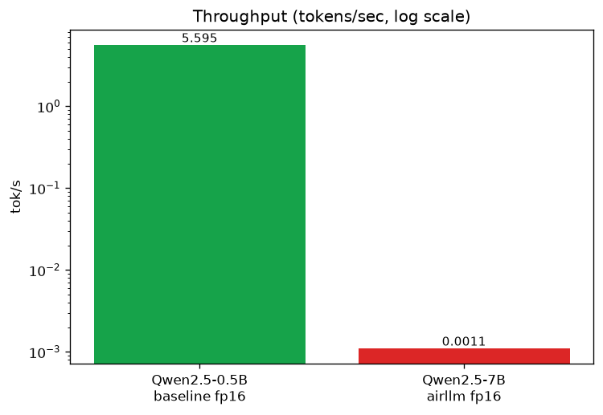
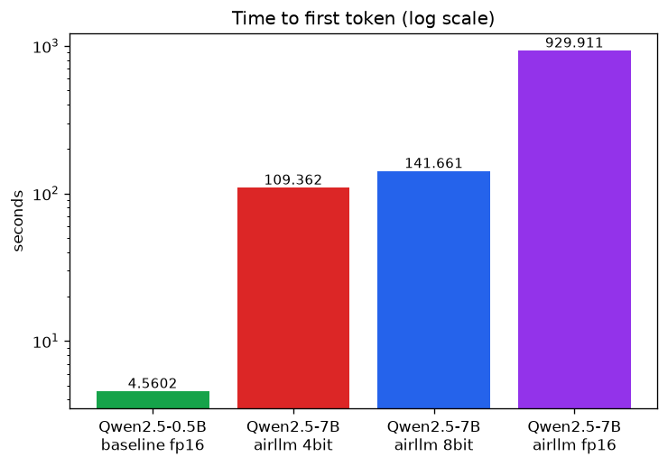
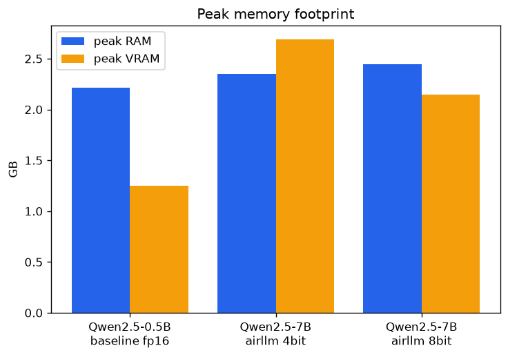
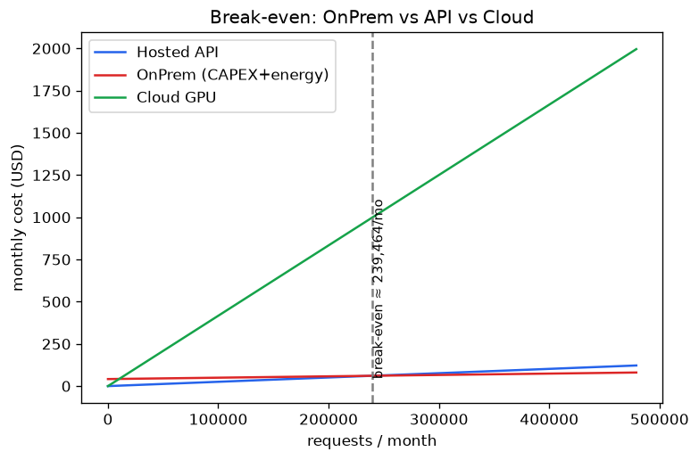
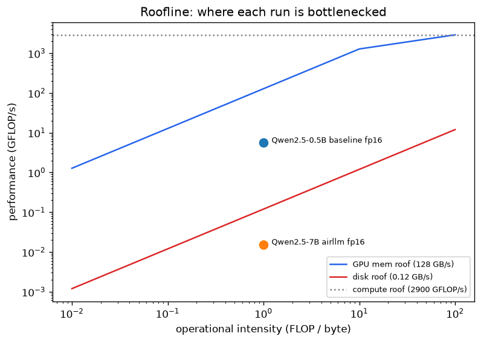

# AirLLM Lab — Running a Massive LLM on Modest Hardware

**Can you run a 7-billion-parameter language model on a laptop with only 4 GB of
GPU memory?** Normally, no. This project shows *why* it fails, then uses
**AirLLM (layered inference)** and **quantization** to make it work anyway — and
measures the cost in speed, memory, and money.

This README is the project's **technical report**: it grows as the work
progresses, linking every claim back to a measurement saved under
[`results/`](results/).

---

## 1. The problem in one picture

A model's weights must fit in memory to run it the normal way. Our target model
does not:

| | Size |
|---|---|
| `Qwen2.5-7B-Instruct` weights (FP16) | **~15 GB** |
| This machine's RAM | 15.8 GB (≈ 8 GB free in practice) |
| This machine's **GPU memory (VRAM)** | **4 GB** |

The weights are bigger than the GPU by almost **4×**, and bigger than the *free*
RAM too. So the naive "load it and run it" approach is doomed — and we prove it
below before fixing it.

## 2. The hardware (the constraint we design around)

Measured automatically and saved to [`results/hardware.json`](results/hardware.json):

| Component | Spec |
|-----------|------|
| CPU | Intel i7-9750H — 6 cores / 12 threads |
| RAM | 15.8 GB |
| GPU | NVIDIA GTX 1650 — **4 GB VRAM** |
| Model storage | `D:` HDD (spinning disk, ~753 GB free) |

Two facts shape everything: **tiny VRAM** (can't hold the model) and a **slow
HDD** (AirLLM streams layers from here, so disk speed becomes the bottleneck).

## 3. The experiment, in stages

```
  Stage 1  Baseline    →  load 7B the normal way        →  FAILS (proof of the wall)
  Stage 2  AirLLM      →  stream the model layer-by-layer →  RUNS on 4 GB VRAM
  Stage 3  Quantization→  shrink 16-bit → 8/4-bit         →  smaller + faster
  Stage 4  Benchmark   →  measure speed, memory, energy   →  compare them all
  Stage 5  Economics   →  local cost vs. paying an API    →  when is each worth it?
```

### Stage 1 — Baseline: watch it fail ✅ done

We deliberately tried to run the 7B model the normal way (load all weights into
RAM, then move to the GPU). The result, captured in
[`results/baseline_Qwen2.5-7B-Instruct.json`](results/baseline_Qwen2.5-7B-Instruct.json):

> **It never finished loading.** The weights overflowed RAM, Windows began
> paging to the HDD, and after **~28 minutes** of swap-thrashing the process
> **crashed** (`0xC0000005`, access violation) at only **61 %** of the
> weight-load — it never even reached the GPU.

This is the finding that justifies the whole project: **direct execution is
infeasible here.** To avoid freezing the machine on every run, the code now does
a **pre-flight memory check** that reports this cleanly in seconds instead of
crashing:

```json
{
  "mode": "baseline",
  "ok": false,
  "error": "baseline infeasible: ~15.2 GB FP16 weights exceed ~8.3 GB available RAM (and 4 GB VRAM); the naive load thrashes swap and crashes the process"
}
```

### Stage 2 — AirLLM: the rescue ✅ done

**AirLLM** loads the model **one layer at a time**: load layer → compute → free
it → load the next. Peak memory becomes the size of a *single layer*, not the
whole model — so a 7B model fits in 4 GB of VRAM. The price is speed: every token
requires reading all 31 layers from the (slow) HDD. This is the classic
**virtual-memory / paging** trade-off applied to neural-network weights.

**Result — the same 7B that crashed the baseline now generates**, on the 4 GB
GPU ([`results/airllm_Qwen2.5-7B-Instruct_fp16.json`](results/airllm_Qwen2.5-7B-Instruct_fp16.json)):

| | Baseline (naive load) | **AirLLM (layered)** |
|---|---|---|
| Outcome | crashed at 61 % of load | **generated `"Virtual memory is a"`** |
| Reached the GPU? | no | yes (`cuda:0`) |
| Time to first token | — | **~930 s** (~15.5 min) |
| Throughput | — | **~0.0011 tok/s** (~15 min / token) |

So AirLLM turns "impossible" into "possible but slow": feasibility is bought with
heavy per-token disk I/O. The next stages attack that slowness with quantization.

> **Engineering note.** AirLLM 2.11 is unmaintained against current `transformers`,
> so the stack is pinned to the compatible `transformers 4.40` era (see
> `pyproject.toml`). Generation is driven by a small greedy-decode loop over the
> model's `forward` (in `services/airllm_runner.py`) rather than `transformers`'
> `generate`, whose newer KV-cache API AirLLM does not support.

### Stage 3 — Quantization ✅ done

Storing weights in fewer bits (FP16 → INT8 → INT4) means **fewer bytes to stream
per layer** — and since AirLLM is disk-bandwidth-bound, that translates almost
directly into speed. Running the *same* prompt on the 7B model at each precision
(via `bitsandbytes`):

| Precision | TTFT | TPOT | Throughput | Runtime (4 tok) | Peak VRAM | Output quality |
|-----------|-----:|-----:|-----------:|----------------:|----------:|----------------|
| FP16 | 930 s | 923 s | 0.0011 tok/s | 3699 s | — | `"Virtual memory is a"` ✅ |
| **INT8** | 142 s | 105 s | 0.0088 tok/s | 456 s | 2.1 GB | `"Virtual memory is a"` ✅ |
| **INT4** | 109 s | **20 s** | **0.0236 tok/s** | 169 s | 2.7 GB | `"Sure memory, in"` ⚠️ |

Two findings:
- **Speed scales with bit-width.** INT4 is **~21× faster** than FP16 and INT8
  **~8×**, because each layer read from the HDD shrinks by 2×/4×.
- **The "accuracy red line" is real.** FP16 and INT8 produce the same coherent
  continuation; **INT4 degrades** into an incoherent one. Here **INT8 is the sweet
  spot** — almost an order of magnitude faster than FP16 with *no* visible quality
  loss; INT4 trades correctness for speed.

> Results: [`results/airllm_Qwen2.5-7B-Instruct_8bit.json`](results/airllm_Qwen2.5-7B-Instruct_8bit.json),
> [`_4bit.json`](results/airllm_Qwen2.5-7B-Instruct_4bit.json). Run them with
> `uv run airllm-lab airllm <model> --quant 8bit` (or `4bit`).

### Stage 4 — Benchmarking ✅ done

A reusable harness (`services/benchmark.py`) runs each configuration *N* times
(with optional warm-ups) and aggregates **mean/median/std/min/max** for every
metric. For each run we record **TTFT** (compute-bound *prefill*), **TPOT**
(memory-bandwidth-bound *decode*), **throughput**, **peak RAM/VRAM** (sampled on a
background thread), total runtime, and an energy estimate.

Plotting the fitting **0.5B baseline** against the **7B AirLLM** runs (FP16/INT8/
INT4) on a log axis shows the cost of layered, disk-streamed inference — up to a
**~5,000×** drop in throughput, partly clawed back by quantization:




Memory tells the other half of the story: AirLLM's peak stays bounded by a single
layer, which is the whole reason a 7B model fits at all.



### Stage 5 — Economic analysis ✅ done

The cost model (`services/cost_model.py`, all assumptions in
[`config/setup.json`](config/setup.json)) compares three options against monthly
volume and solves for the **break-even** — saved to
[`results/cost_analysis.json`](results/cost_analysis.json):

| Option | Per request | Monthly @ 10k req |
|--------|-------------|-------------------|
| Hosted API | **$0.000255** | **$2.55** |
| OnPrem (CAPEX + energy) | $0.004248 | $42.48 |
| Cloud GPU | $0.004167 | $41.67 |



Even with a *generous* "efficient local" assumption (30 s/request), OnPrem only
overtakes the API at **~239,000 requests/month**. With the **measured** AirLLM 7B
runtime (thousands of seconds/request), local **energy alone** exceeds the API
price, so it **never breaks even**. The honest recommendation: **API on cost and
latency; local only when data privacy or offline operation is a hard requirement.**

### Extension — Roofline analysis ⭐

Our original extension answers *why* everything is slow with a **roofline model**.
Attainable performance is bounded by `min(peak_compute, bandwidth × intensity)`.
LLM decode has an intensity of ~1 FLOP/byte, so it lives on the slanted
*bandwidth* roof — never near the compute roof. Both runs are pinned far below
peak FLOP/s; the 7B AirLLM point sits on the **disk** roof, proving the HDD (not
the GPU) is its bottleneck.



The full narrative — tables, charts, and the concept walkthrough — lives in the
reproducible analysis notebook: [`notebooks/analysis.ipynb`](notebooks/analysis.ipynb).

## 4. The six research questions, answered

**1. What is the bottleneck blocking direct execution — memory or compute?**
**Memory.** The 7B's ~15 GB of FP16 weights exceed both the 4 GB VRAM and the
~8 GB of free RAM, so the naive load thrashed swap and crashed (Stage 1). The
roofline (extension) confirms it: every run sits far below the compute roof, on
the *bandwidth* roof — never compute-limited.

**2. How does AirLLM change resource allocation, and how does it relate to virtual
memory / OS paging?** AirLLM keeps weights on disk and loads **one layer at a
time** (load → compute → free), so peak memory is ~a single layer instead of the
whole model. This is exactly **OS paging / virtual memory** made literal: disk is
used as an extension of memory, trading latency for capacity.

**3. Impact of quantization on memory, speed, and quality — where is the accuracy
"red line"?** Fewer bits ⇒ fewer bytes streamed per layer ⇒ faster: **INT8 ≈ 8×**
and **INT4 ≈ 21×** vs FP16, at ~2 GB VRAM (Stage 3). The **red line is INT4**:
FP16 and INT8 stay coherent (`"Virtual memory is a"`), INT4 degrades
(`"Sure memory, in"`). **INT8 is the sweet spot.**

**4. How do Prefill vs Decode show up across TTFT and TPOT?** **TTFT** times the
parallel, compute-heavy **prefill** (building the KV-cache); **TPOT** times the
per-token **decode**, which is memory-bandwidth-bound. On AirLLM both are inflated
because each step streams layer weights from the HDD.

**5. What latency/throughput price is paid to run a big model on modest hardware?**
A steep one: vs a model that *fits*, AirLLM throughput drops up to **~5,000×**
(FP16: ~930 s to first token, ~0.0011 tok/s). Quantization recovers an order of
magnitude, but it remains a correctness demo, not a serving solution (Stage 4).

**6. When is OnPrem cheaper than an external API?** Rarely, at this scale. Even
with a generous local-runtime assumption, OnPrem only beats the API past
**~239,000 requests/month**; with the *measured* AirLLM runtime it **never** breaks
even (Stage 5). Choose **API for cost/latency; local only for privacy or offline**
requirements.

## 5. How the code is organized

A single **SDK facade** (`LabSDK`) is the one entry point; the CLI and notebooks
call it, never the internals (keeps business logic in one place).

```
src/airllm_lab/
  sdk/            LabSDK facade — the only public entry point
  services/       hardware probe, model download, baseline + AirLLM runners,
                  benchmark harness, metrics, monitor, feasibility,
                  cost_model, charts, roofline
  shared/         config, secrets (.env), storage/paths, version
  main.py         thin CLI
config/           versioned JSON config (no hardcoded values)
results/          saved measurements (hardware, baseline, benchmarks, cost)
assets/           generated figures (throughput, latency, memory, cost, roofline)
notebooks/        analysis.ipynb — reproducible results & concept walkthrough
docs/             PRD, PLAN, per-mechanism PRDs, working map
tests/            unit + integration tests (100 % coverage today)
```

## 6. Try it yourself

```bash
uv sync                                     # set up env + install deps
uv run airllm-lab hardware                  # probe + save this machine's spec
uv run airllm-lab smoke                     # run a tiny 0.5B model end-to-end
uv run airllm-lab download Qwen/Qwen2.5-7B-Instruct   # fetch the big model to D:
uv run airllm-lab baseline <path-to-model>  # the (failing) naive baseline
uv run airllm-lab airllm <path-to-model>    # layered inference that actually runs
uv run airllm-lab benchmark <path-to-model> --repeats 3   # N runs + aggregates

uv sync --extra viz                         # add the plotting/notebook deps
uv run airllm-lab cost                       # economic break-even analysis
uv run airllm-lab charts                     # render figures into assets/
uv run airllm-lab roofline                   # render the roofline (extension)
```

Secrets (e.g. a Hugging Face token) go in a local, git-ignored `.env`
(see `.env.example`). Large model files are kept off the small `C:` drive.

## 7. Planning & design documents

| Document | Purpose |
|----------|---------|
| [`docs/PRD.md`](docs/PRD.md) | Product requirements, goals, KPIs, acceptance criteria |
| [`docs/PLAN.md`](docs/PLAN.md) | Architecture (C4), interfaces, ADRs |
| [`docs/TODO.md`](docs/TODO.md) | Standards & rules + the ordered working map |
| [`docs/PRD_airllm.md`](docs/PRD_airllm.md) | AirLLM layered-inference mechanism |
| [`docs/PRD_quantization.md`](docs/PRD_quantization.md) | Quantization mechanism |
| [`docs/PRD_benchmark.md`](docs/PRD_benchmark.md) | Benchmarking & metrics |
| [`docs/PRD_cost_model.md`](docs/PRD_cost_model.md) | OnPrem vs API cost model |
| [`docs/PROMPT_BOOK.md`](docs/PROMPT_BOOK.md) | Log of significant AI prompts used to build this |

## 8. Progress

- [x] **Phase 0–1** — planning docs + project scaffold (SDK, CLI, config, tests)
- [x] **Phase 2** — pipeline smoke test (0.5B model runs end-to-end on GPU)
- [x] **Phase 3** — hardware report, 7B download, **baseline failure documented**
- [x] **Phase 4** — **AirLLM runner, benchmark harness, and FP16/INT8/INT4 quant matrix done**
- [x] **Phase 5** — **cost model, charts, analysis notebook, and roofline extension done**
- [x] **Phase 6** — report finalized (research questions, LICENSE, Prompt Book); awaiting review & submission

**Quality gates (current):** ruff clean · 69 tests passing · 100 % coverage · every
Python file ≤ 150 lines · secrets via `.env` · `uv`-managed.

## License

MIT — see [`LICENSE`](LICENSE).
