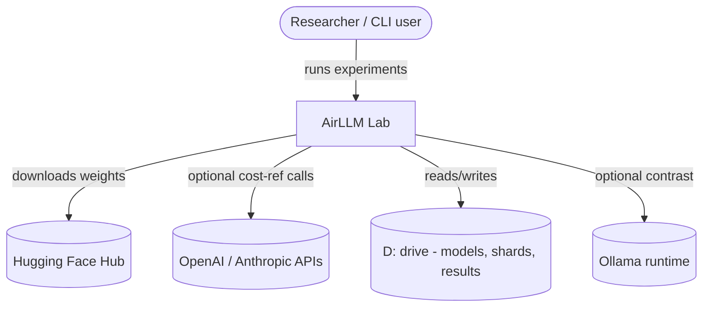
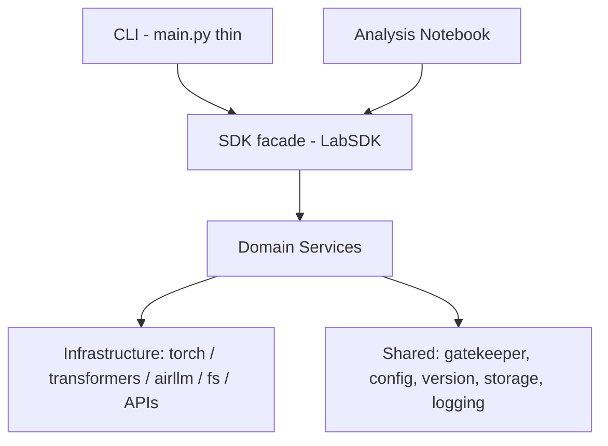

# PLAN — Architecture & Technical Design

**Project:** Running a Massive LLM Locally — AirLLM, Quantization & Benchmarking
**Version:** 1.00 · **Status:** DRAFT
**Package name:** `airllm_lab` (under `src/`)

This document defines the architecture, interfaces, data schemas, and the key
architectural decisions (ADRs). It follows the SDK-layer + OOP rules in `docs/TODO.md`.

---

## 1. C4 — Level 1: Context



The system is a local experimentation lab. External systems: HF Hub (weights),
optional LLM APIs (cost reference), the D: drive (heavy artifacts), optional Ollama.

## 2. C4 — Level 2: Containers



- **CLI / Notebook** — entry points only; no business logic; delegate to SDK.
- **SDK (`LabSDK`)** — single entry point exposing every capability.
- **Domain Services** — the actual logic (probe, download, runners, benchmark, cost, viz).
- **Shared** — cross-cutting concerns (API gatekeeper, config, versioning, paths, logging).
- **Infrastructure** — third-party libs and the file system.

## 3. C4 — Level 3: Components (modules, each file ≤ 150 lines)

```
src/airllm_lab/
├── __init__.py            # exports LabSDK, __version__
├── main.py                # thin CLI (argparse) -> LabSDK
├── constants.py           # Enums (QuantLevel, RunMode), physical constants
├── sdk/
│   ├── __init__.py
│   └── sdk.py             # LabSDK facade (delegates to services)
├── services/
│   ├── __init__.py
│   ├── hardware.py        # HardwareProbe -> HardwareSpec
│   ├── model_download.py  # ModelDownloader (HF, to D:)
│   ├── base_runner.py     # BaseRunner (Template Method: shared run/measure flow)
│   ├── baseline_runner.py # BaselineRunner(BaseRunner) - direct Transformers
│   ├── airllm_runner.py   # AirLLMRunner(BaseRunner) - layered + quant
│   ├── metrics.py         # TTFT/TPOT/throughput math + memory sampling
│   ├── benchmark.py       # BenchmarkHarness (repeat, aggregate, persist)
│   ├── cost_model.py      # API / OnPrem / CloudGPU costs + break-even
│   └── visualization.py   # charts -> assets/
└── shared/
    ├── __init__.py
    ├── gatekeeper.py      # ApiGatekeeper (rate limit, FIFO queue, retry, log)
    ├── config.py          # Config loader + version validation
    ├── version.py         # __version__ = "1.00"
    ├── storage.py         # path helpers (force heavy artifacts to D:)
    └── logging_setup.py   # logging config from logging_config.json
```

> If any file approaches 150 lines we split (helpers/mixins), never compress.

## 4. Key interfaces

### 4.1 SDK facade (single entry point)
```python
class LabSDK:
    """Single entry point for all lab capabilities."""
    def __init__(self, config: Config) -> None: ...
    def probe_hardware(self) -> HardwareSpec: ...
    def download_model(self, model_id: str) -> Path: ...
    def run_baseline(self, cfg: RunConfig) -> RunResult: ...
    def run_airllm(self, cfg: RunConfig) -> RunResult: ...
    def benchmark(self, cfg: RunConfig, repeats: int) -> BenchmarkReport: ...
    def analyze_costs(self, usage: UsageProfile) -> CostReport: ...
    def make_figures(self, report: BenchmarkReport) -> list[Path]: ...
```

### 4.2 API Gatekeeper (all external API calls route here)
```python
class ApiGatekeeper:
    """Centralized API call manager (rate limit + queue + retry + log)."""
    def __init__(self, config: RateLimitConfig) -> None: ...
    def execute(self, api_call, *args, **kwargs): ...      # enforce limits, queue, retry
    def get_queue_status(self) -> QueueStatus: ...
```

### 4.3 Runner template (shared baseline/AirLLM flow → DRY)
```python
class BaseRunner:
    """Template Method: load -> warmup -> generate(streaming) -> collect metrics."""
    def run(self, cfg: RunConfig) -> RunResult: ...        # orchestrates the steps
    def _load_model(self, cfg): ...                        # overridden by subclass
    def _generate(self, cfg): ...                          # overridden by subclass
```

## 5. Data schemas (dataclasses, persisted as JSON in `results/`)

- **HardwareSpec**: `cpu_name, cores, threads, ram_gb, gpu_name, vram_gb, disk_type, free_gb`
- **RunConfig**: `model_id, mode (baseline|airllm), quant (FP16|Q8|Q4|Q2), prompt, max_new_tokens, repeats`
- **RunResult**: `ttft_s, tpot_s, throughput_tok_s, peak_ram_mb, peak_vram_mb, runtime_s, energy_wh, n_input_tokens, n_output_tokens, output_text, ok, error`
- **BenchmarkReport**: `spec, runs: list[RunResult], aggregates`
- **UsageProfile**: `requests_per_month, avg_input_tokens, avg_output_tokens, cached_fraction`
- **CostReport**: `api_cost, onprem_cost, cloudgpu_cost, breakeven_requests, assumptions`

## 6. Configuration (versioned; no hardcoded values)

```
config/
├── setup.json            # app config: model ids, prompts, paths, "version": "1.00"
├── rate_limits.json      # gatekeeper limits, "version": "1.00"
└── logging_config.json   # logging setup
.env / .env.example       # HF_TOKEN, OPENAI_API_KEY, ANTHROPIC_API_KEY (dummy in example)
```
`Config` validates that `setup.json.version` matches `version.py.__version__` at startup.

## 7. Architectural Decision Records (ADRs)

| # | Decision | Rationale / Trade-off |
|---|----------|------------------------|
| ADR-1 | **uv** as the only package manager/runner | Mandated by guidelines; reproducible lockfile |
| ADR-2 | **SDK facade** as single entry point | Mandated; CLI/notebook stay logic-free, testable |
| ADR-3 | **Qwen2.5 family** + `AutoModel` | Assignment-recommended; avoids class-mismatch; size range |
| ADR-4 | **Transformers primary**, Ollama optional | Full control of dtype/device_map + precise token timing |
| ADR-5 | **All heavy artifacts on `D:`** (HDD) | `C:` only ~10 GB free; accept I/O-bound cost (a key finding) |
| ADR-6 | **Modeled API prices primary**, live calls optional via Gatekeeper | No key needed to complete core analysis; safer |
| ADR-7 | **Template-Method `BaseRunner`** | DRY: baseline & AirLLM share load/measure flow |
| ADR-8 | **Streaming token timing** for TTFT/TPOT | First-token vs per-token split needs per-token timestamps |
| ADR-9 | **Memory sampling** via background poller (psutil + nvidia-smi/torch) | Capture peak RAM/VRAM during generation |

## 8. Testing strategy (TDD, ≥85%)

- `tests/unit/` mirrors `src/`; pure logic (metrics math, cost model, config, gatekeeper
  queue/rate-limit) is unit-tested with mocks — **no model downloads or live APIs in tests**.
- `tests/integration/` exercises the SDK with a fake/tiny runner double.
- Heavy/torch-dependent code isolated behind small seams so it can be mocked.
- `conftest.py` provides fixtures (sample RunResult, fake config, temp dirs).

## 9. Risks & mitigations

| Risk | Mitigation |
|------|------------|
| HDD makes AirLLM very slow | Start with 7B; cap `max_new_tokens`; treat slowness as a measured finding |
| `C:` fills during download | Force HF cache + shards to `D:` via env + config; pre-check free space |
| 4 GB VRAM OOM | AirLLM layered offload; small batch; FP16/Q8/Q4 sweep |
| Python/torch CUDA wheel mismatch | Pin Python 3.12 + a known-good torch CUDA build via uv |
| Coverage drops below 85% | Keep torch I/O thin; test pure logic thoroughly |
